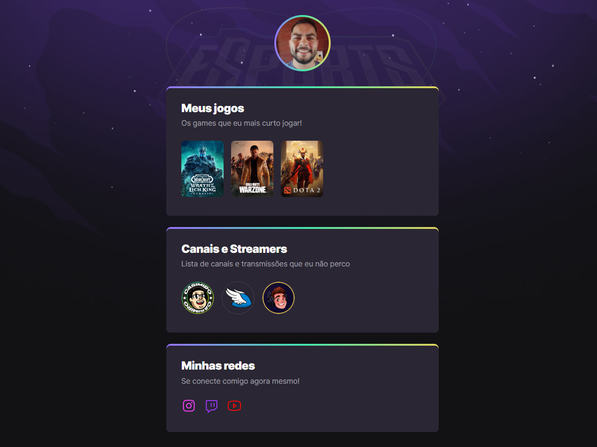

# NLW eSports

Clique [aqui](https://arthursandim.github.io/nlw-esports/) para acessar a versão hospedada no Github Pages.

>NLW eSports Trilha explorer

## 🛠️ Tecnologias usadas
  
- HTML
- CSS
- Git e GitHub

## 📚 O que aprendi?

- Estruturar um HTML5 de uma página simples, somente com boxes;
- Atribuir, transições e animações estilos com CSS3;
- Salvar o repositório no github;

## 🖥️ Contato

- [Email](avg.sandim@gmail.com)

- [Linkedin](https://www.linkedin.com/in/arthur-sandim-662b23104/)
